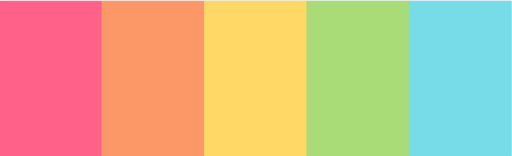
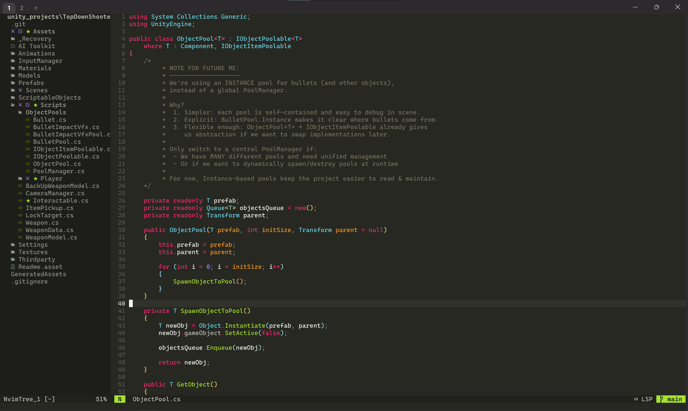
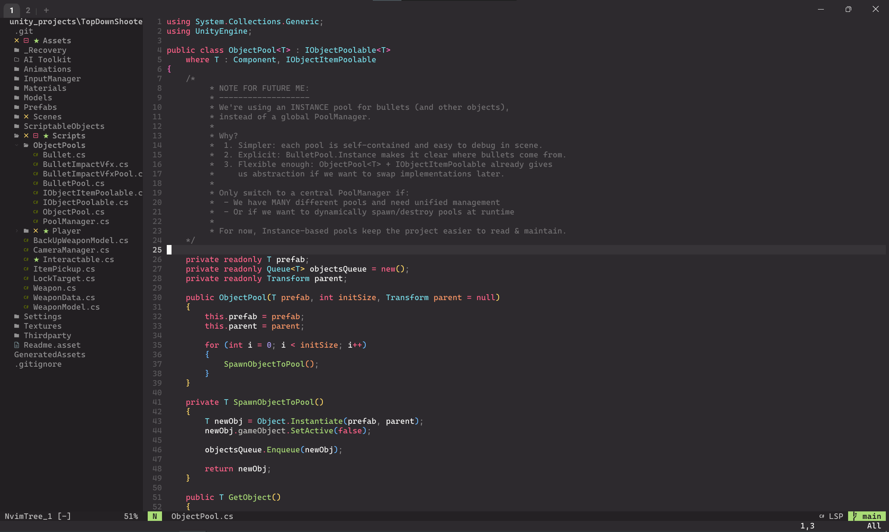
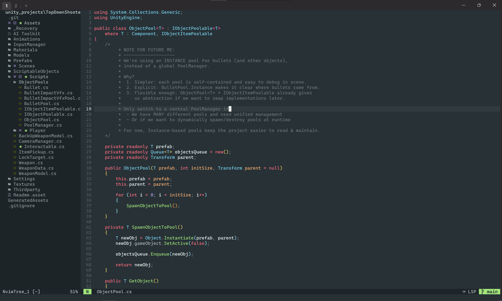
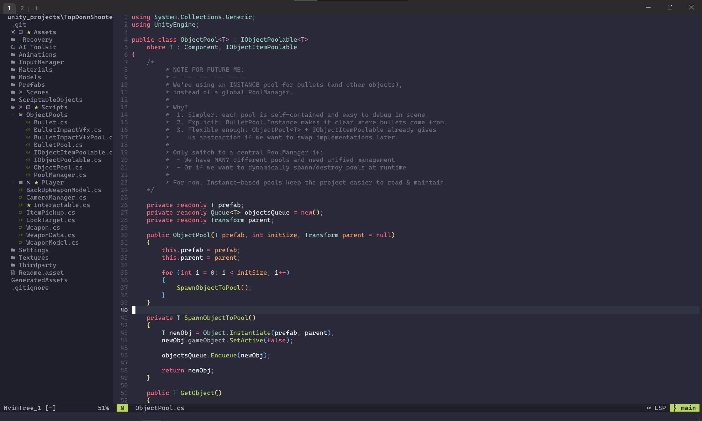
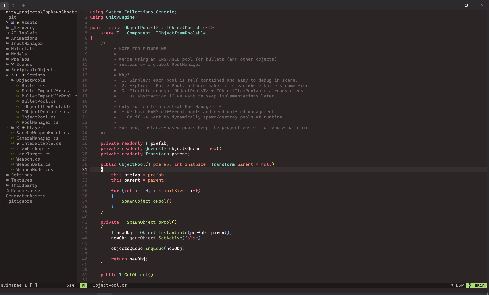
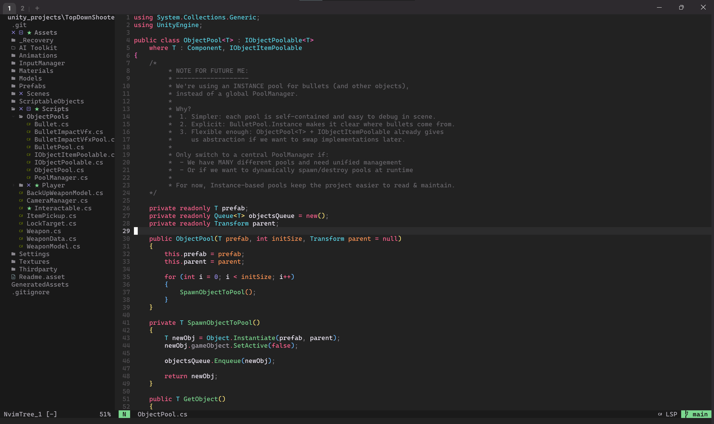
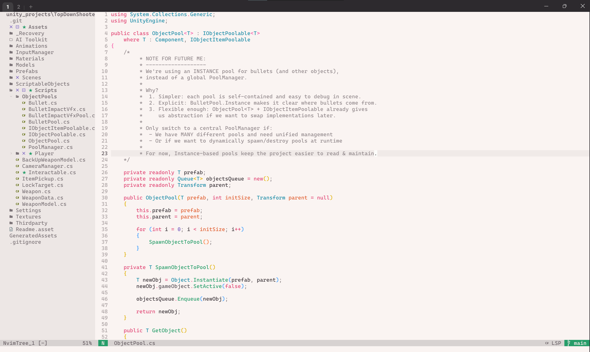

<p align="center">
  
</p>

> [!IMPORTANT]
> **Clear Cache After Updating**
>
> This colorscheme uses a compiled highlight cache for fast startup performance.  
> Because of this, you **must clear the cache every time the plugin updates** — including:
> - After `Lazy sync` or `Lazy update`
> - After pulling new commits or PRs
> - After switching branches
> - After changing filter or style settings
>
> Run this command after updating:
>
> ```vim
> :MonokaiClear
> ```
> Exit Neovim
> 
> The theme will automatically recompile on the next load.

# Monokai Pro V2

A fork of [loctvl842/monokai-pro.nvim](https://github.com/loctvl842/monokai-pro.nvim) with personal improvements and additional plugin support.

## About

This is a personal fork of the excellent monokai-pro.nvim theme for Neovim. While the original theme is already feature-rich and well-maintained, I've made some improvements to better suit my workflow and preferences.

## Differences from Original

This fork introduces several improvements and additional support compared to the original:

- **Better Treesitter Support** – More precise syntax highlighting across multiple languages, including fallback colors for C# and other languages without active LSP.  
- **Respect LSP Semantic Tokens** – Ensures colors match LSP token types when available, providing consistent highlighting between Treesitter and LSP.  
- **UI Bug Fixes** – Fixed issues with floating windows, markdown previews, and other elements that didn’t render correctly with the original theme.  
- **Toggle Italics in Treesitter** – Users can easily enable or disable italic styles globally via configuration.  
- **Expanded Plugin Support** – Added styling for popular plugins (Barbar, Oil, Avante, Grug-far, etc.)
- **Blazing Fast Performance** – Uses a compilation system to statically cache highlights, reducing startup time to ~2ms. 

These improvements aim to make the theme **more consistent, modern, and configurable** for Neovim setup.


## Installation

### Lazy.nvim (Recommended)

```lua
{
  "khoido2003/monokai-v2.nvim",
  priority = 1000,
  config = function()
    require("monokai-v2").setup()
    vim.cmd("colorscheme monokai-v2")
  end,
}
```

### Packer

```lua
use {
  "khoido2003/monokai-v2.nvim",
  config = function()
    require("monokai-v2").setup()
    vim.cmd("colorscheme monokai-v2")
  end
}
```

## Optional Dependencies

For the best experience, consider installing these optional plugins:

### nvim-web-devicons

For **Monokai-themed file icons** in file explorers (nvim-tree, neo-tree, telescope, etc.):

```lua
-- Add to your plugin manager
{ "nvim-tree/nvim-web-devicons" }
```

Then enable devicons in the theme config:

```lua
require("monokai-v2").setup({
  devicons = true,  -- Enable Monokai colors for file icons
})
```

This will colorize 200+ file type icons with Monokai colors. Requires a [Nerd Font](https://www.nerdfonts.com/).

> **Note:** Devicons support is enabled by default. If you don't have nvim-web-devicons installed, it will be safely skipped.


## Configuration

```lua
require("monokai-v2").setup({
  -- Basic settings
  transparent_background = false,
  terminal_colors = true,
  devicons = true,
  
  -- Syntax highlighting styles
  styles = {
    comment = { italic = false },
    keyword = { italic = false },
    type = { italic = false },
    storageclass = { italic = false },
    structure = { italic = false },
    parameter = { italic = false },
    annotation = { italic = false },
    tag_attribute = { italic = false },
  },
  
  -- Treesitter settings
  treesitter = {
    italic = false,
  },
  
  -- Filter selection (default: classic for dark, light for light background)
  filter = "pro", -- classic | light | machine | octagon | pro | ristretto | spectrum
  
  -- Day/night mode
  day_night = {
    enable = false,
    day_filter = "pro",
    night_filter = "spectrum",
  },
  
  -- Incremental search style
  inc_search = "background", -- underline | background
  
  -- Background clearing for floating windows
  background_clear = {
    "toggleterm",
    "telescope", 
    "renamer",
    "notify",
  },
  
  -- Plugin-specific settings
  plugins = {
    bufferline = {
      underline_selected = false,
      underline_visible = false,
      underline_fill = false,
      bold = true,
    },
    indent_blankline = {
      context_highlight = "default", -- default | pro
      context_start_underline = false,
    },
  },
})
```

## Usage

### Commands

- `MonokaiThemeSelect` - Interactive menu to select filter variant
- `MonokaiChoose <filter>` - Direct filter selection (e.g., `MonokaiChoose pro`)
- `MonokaiCompile` - Manually compile the theme highlights to cache
- `MonokaiClear` - Clear the theme cache
- `MonokaiRefreshTokens` - Manually refresh semantic tokens (useful for keeping highlights in sync with LSP)

### Statusline Integration

```lua
-- Lualine
require('lualine').setup({
  options = {
    theme = 'monokai-v2'
  }
})

-- Barbecue
require('barbecue').setup({
  theme = 'monokai-v2'
})

-- Lightline
let g:lightline = {'colorscheme': 'monokaiv2'}
```


## Filter Variants

Each filter provides a unique take on the Monokai Pro theme:

- **Classic** - The original Monokai theme 
- **Light** - Light variant for bright environments 
- **Pro** - The signature Monokai Pro look
- **Machine** - Industrial, high-contrast variant
- **Octagon** - Geometric, structured appearance
- **Ristretto** - Muted, coffee-inspired tones
- **Spectrum** - Vibrant, colorful variant


## Gallery:

| Filter | Preview |
|--------|---------|
| **Classic** |  |
| **Pro** |  |
| **Machine** |  |
| **Octagon** |  |
| **Ristretto** |  |
| **Spectrum** |  |
| **Light** |  |


## Contributing

If you'd like to help improve this theme:

- Open an issue if you find any bugs
- Submit a PR if you have any improvements
- Share your ideas through discussions

Feel free to:

- Report issues
- Suggest improvements
- Submit pull requests

## Credits

- **Original theme**: [loctvl842/monokai-pro.nvim](https://github.com/loctvl842/monokai-pro.nvim) by [Loc](https://github.com/loctvl842)
- **Monokai Pro**: [monokai.pro](https://monokai.pro/)

This is a personal fork with personal improvements and preferences. For the original, well-maintained theme, please check out the source repository.
